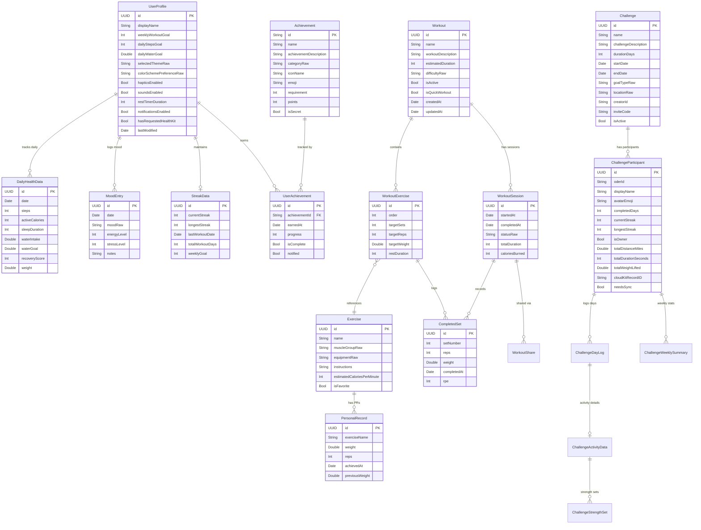
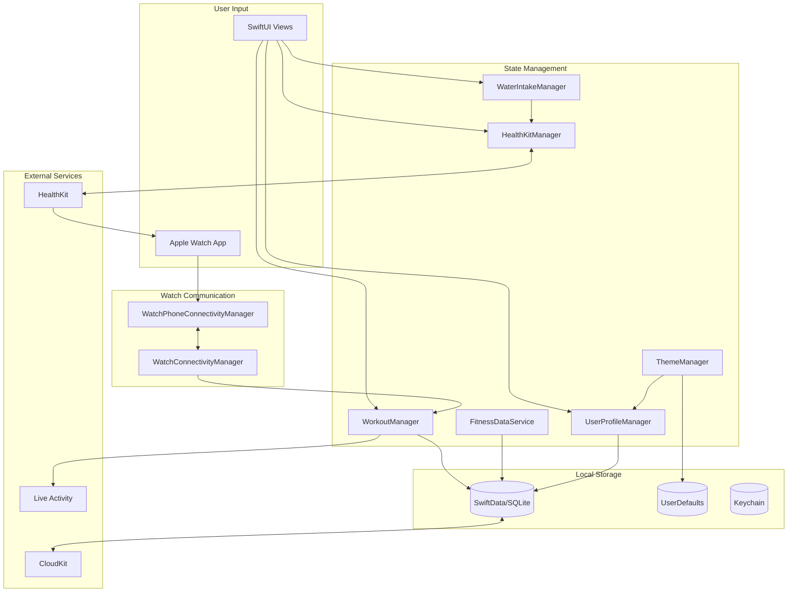
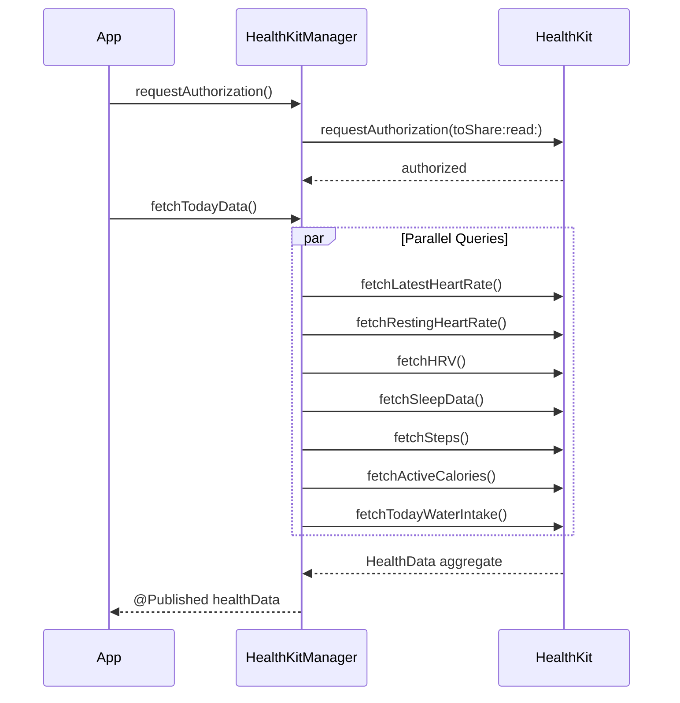
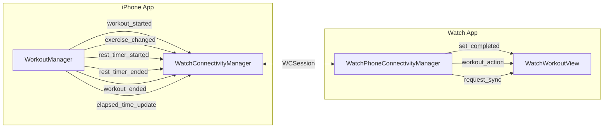
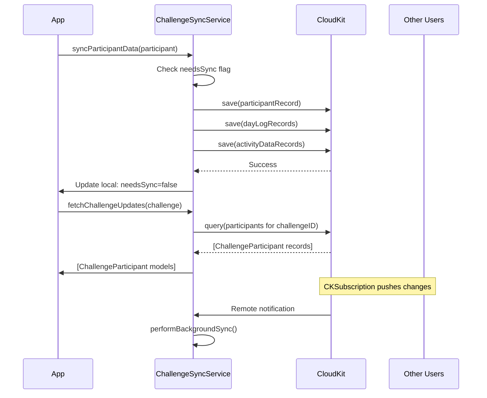
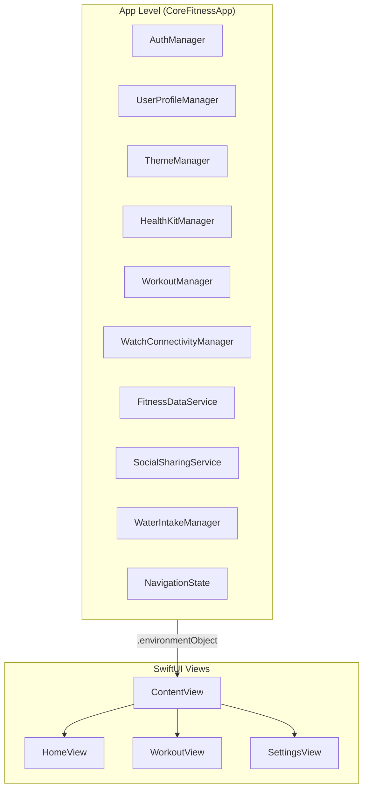
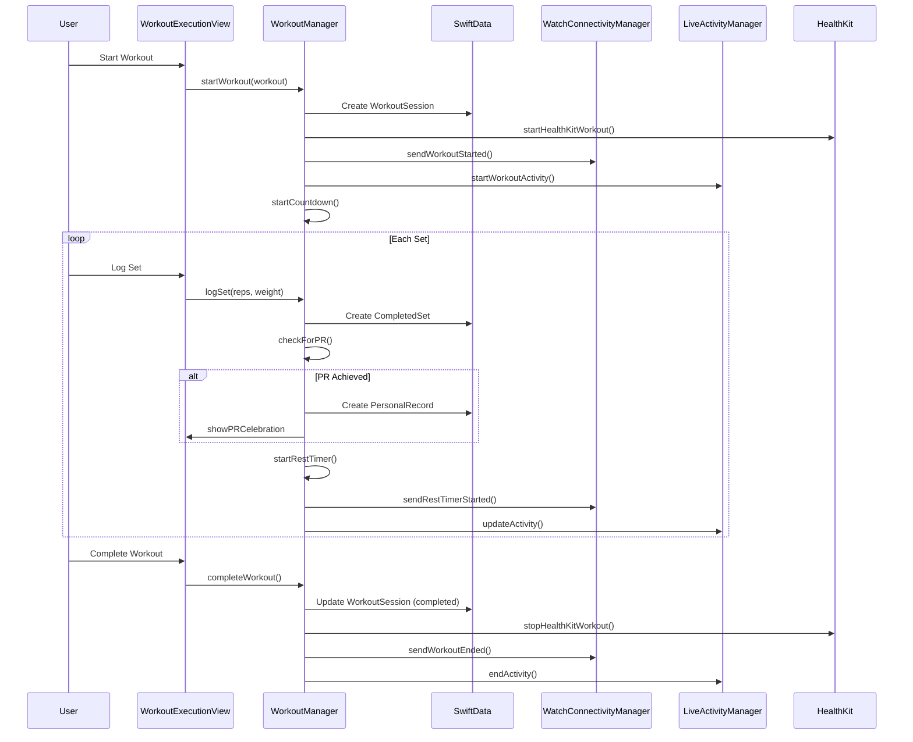
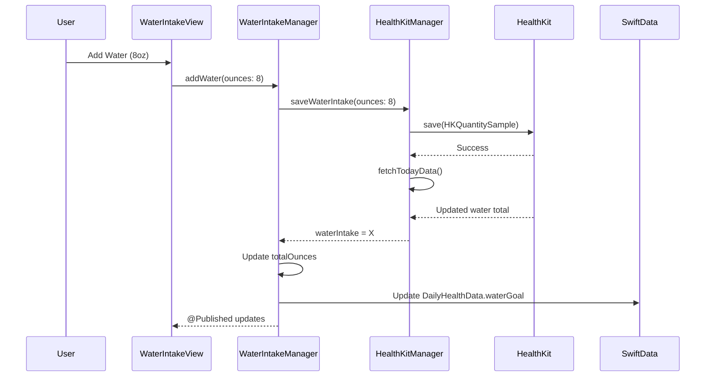
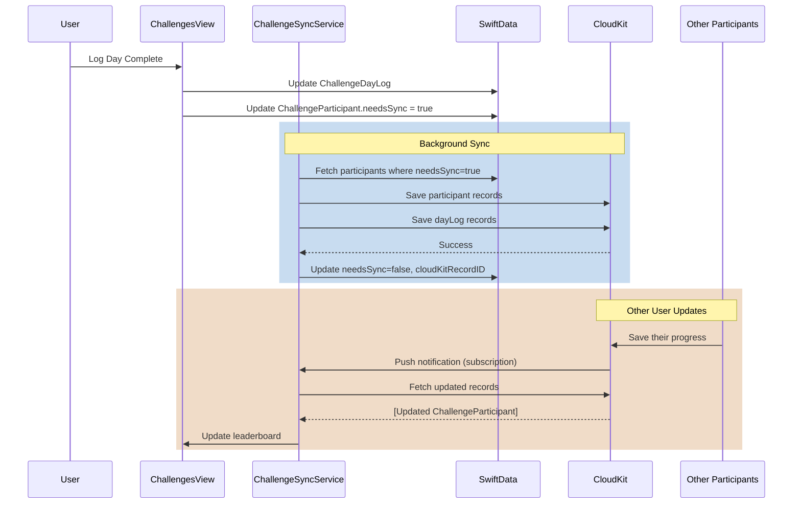

# CoreFitness Data Architecture Analysis

## Executive Summary

CoreFitness is a comprehensive iOS/watchOS fitness application built with SwiftUI and SwiftData. The app features workout tracking, health integration, social challenges, and cross-device synchronization. This document provides a complete analysis of the data architecture including models, storage mechanisms, synchronization patterns, and integration points.

**Key Technologies:**
- **Data Persistence:** SwiftData with iCloud/CloudKit automatic sync
- **Health Integration:** HealthKit for health metrics read/write
- **Cross-Device Sync:** WatchConnectivity framework for iPhone-Watch communication
- **Cloud Sync:** CloudKit for challenge data sharing between users
- **State Management:** ObservableObject pattern with EnvironmentObject injection
- **Live Updates:** ActivityKit for Lock Screen/Dynamic Island widgets

---

## Table of Contents

1. [Data Model Diagram](#data-model-diagram)
2. [Data Flow Diagram](#data-flow-diagram)
3. [SwiftData Models](#swiftdata-models)
4. [HealthKit Integration](#healthkit-integration)
5. [Watch Connectivity](#watch-connectivity)
6. [CloudKit Sync](#cloudkit-sync)
7. [State Management](#state-management)
8. [Local Storage](#local-storage)
9. [Sequence Diagrams](#sequence-diagrams)
10. [Analysis & Recommendations](#analysis--recommendations)
11. [Data Dictionary](#data-dictionary)

---

## Data Model Diagram



---

## Data Flow Diagram



---

## SwiftData Models

### Overview

The application uses SwiftData with CloudKit automatic synchronization. All models are marked with `@Model` and stored in a single `ModelContainer`.

**File:** `/Users/jeffmiller/Projects/Fitness_iOS/CoreFitness/App/CoreFitnessApp.swift` (lines 83-144)

```swift
let schema = Schema([
    // Workout Models
    Exercise.self,
    Workout.self,
    WorkoutExercise.self,
    WorkoutSession.self,
    CompletedSet.self,
    // Fitness Data Models
    PersonalRecord.self,
    DailyHealthData.self,
    MoodEntry.self,
    StreakData.self,
    Achievement.self,
    UserAchievement.self,
    WorkoutShare.self,
    WeeklySummary.self,
    MonthlySummary.self,
    UserProfile.self,
    // Challenge Models
    Challenge.self,
    ChallengeParticipant.self,
    ChallengeDayLog.self,
    ChallengeActivityData.self,
    ChallengeStrengthSet.self,
    ChallengeWeeklySummary.self
])

let modelConfiguration = ModelConfiguration(
    schema: schema,
    isStoredInMemoryOnly: false,
    cloudKitDatabase: .automatic  // Enables iCloud sync
)
```

### Model Categories

#### 1. Workout Domain Models

| Model | Purpose | File Location |
|-------|---------|---------------|
| `Exercise` | Exercise template/definition | `/CoreFitness/Models/WorkoutModels.swift` |
| `Workout` | Workout template containing exercises | `/CoreFitness/Models/WorkoutModels.swift` |
| `WorkoutExercise` | Join table: exercise config per workout | `/CoreFitness/Models/WorkoutModels.swift` |
| `WorkoutSession` | Instance of completed/in-progress workout | `/CoreFitness/Models/WorkoutModels.swift` |
| `CompletedSet` | Individual set logged during session | `/CoreFitness/Models/WorkoutModels.swift` |

#### 2. Health & Wellness Models

| Model | Purpose | File Location |
|-------|---------|---------------|
| `DailyHealthData` | Daily health metrics aggregation | `/CoreFitness/Models/FitnessDataModels.swift` |
| `MoodEntry` | Daily mood tracking entries | `/CoreFitness/Models/FitnessDataModels.swift` |
| `PersonalRecord` | Exercise PRs with history | `/CoreFitness/Models/FitnessDataModels.swift` |
| `StreakData` | Workout streak tracking | `/CoreFitness/Models/FitnessDataModels.swift` |

#### 3. Challenge Domain Models

| Model | Purpose | File Location |
|-------|---------|---------------|
| `Challenge` | Multi-user fitness challenge | `/CoreFitness/Models/ChallengeModels.swift` |
| `ChallengeParticipant` | User participating in challenge | `/CoreFitness/Models/ChallengeModels.swift` |
| `ChallengeDayLog` | Daily completion log | `/CoreFitness/Models/ChallengeModels.swift` |
| `ChallengeActivityData` | Detailed activity metrics | `/CoreFitness/Models/ChallengeModels.swift` |
| `ChallengeStrengthSet` | Strength sets within challenge | `/CoreFitness/Models/ChallengeModels.swift` |
| `ChallengeWeeklySummary` | Weekly stats per participant | `/CoreFitness/Models/ChallengeModels.swift` |

#### 4. User & Profile Models

| Model | Purpose | File Location |
|-------|---------|---------------|
| `UserProfile` | User settings and preferences | `/CoreFitness/Models/FitnessDataModels.swift` |
| `Achievement` | Achievement definitions | `/CoreFitness/Models/FitnessDataModels.swift` |
| `UserAchievement` | User's earned achievements | `/CoreFitness/Models/FitnessDataModels.swift` |
| `WorkoutShare` | Social sharing history | `/CoreFitness/Models/FitnessDataModels.swift` |

---

## HealthKit Integration

**File:** `/Users/jeffmiller/Projects/Fitness_iOS/CoreFitness/Services/HealthKit/HealthKitManager.swift`

### Data Types Read

| HealthKit Type | App Usage | Query Type |
|----------------|-----------|------------|
| `heartRate` | Real-time during workout, daily metrics | Sample Query, Anchored Query |
| `restingHeartRate` | Recovery score calculation | Statistics Query (average) |
| `heartRateVariabilitySDNN` | HRV tracking for recovery | Sample Query (latest) |
| `sleepAnalysis` | Sleep duration and quality | Sample Query with category filtering |
| `stepCount` | Daily step tracking | Statistics Query (cumulative) |
| `activeEnergyBurned` | Calories burned | Statistics Query (cumulative) |
| `dietaryWater` | Water intake sync | Statistics Query (cumulative) |

### Data Types Written

| HealthKit Type | App Usage | Write Trigger |
|----------------|-----------|---------------|
| `workoutType` | Save completed workouts | Workout completion |
| `activeEnergyBurned` | Workout calories | During workout session |
| `dietaryWater` | Water intake logging | User adds water |

### Query Patterns



### Workout Import for Challenges

The app can import HealthKit workouts into challenge tracking:

```swift
// Fetch workouts for a date range
func fetchWorkouts(from: Date, to: Date, type: HKWorkoutActivityType?) async -> [HKWorkout]

// Convert HKWorkout to ChallengeActivityData
func createActivityData(from workout: HKWorkout) -> ChallengeActivityData
```

---

## Watch Connectivity

### iPhone Side

**File:** `/Users/jeffmiller/Projects/Fitness_iOS/CoreFitness/App/WatchConnectivityManager.swift`

### Watch Side

**File:** `/Users/jeffmiller/Projects/Fitness_iOS/CoreFitnessWatch Watch App/WatchPhoneConnectivityManager.swift`

### Communication Channels

| Channel | Method | Use Case | Delivery |
|---------|--------|----------|----------|
| `sendMessage` | Interactive | Real-time sync during workout | Immediate (requires reachability) |
| `transferUserInfo` | Background | Queued data transfer | Guaranteed delivery |
| `updateApplicationContext` | State sync | Settings synchronization | Latest value only |

### Message Types



### Message Payloads

**iPhone to Watch:**

```swift
// workout_started
[
    "type": "workout_started",
    "workoutName": String,
    "exercise": String,
    "totalSets": Int,
    "showCountdown": Bool,
    "timestamp": TimeInterval
]

// exercise_changed
[
    "type": "exercise_changed",
    "exercise": String,
    "setNumber": Int,
    "totalSets": Int,
    "targetWeight": Double?,
    "targetReps": Int?
]

// rest_timer_started
[
    "type": "rest_timer_started",
    "duration": Int
]
```

**Watch to iPhone:**

```swift
// set_completed
[
    "type": "set_completed",
    "exerciseId": String,
    "weight": Double,
    "reps": Int,
    "timestamp": TimeInterval
]

// workout_action
[
    "type": "workout_action",
    "action": String  // "pause", "resume", "skip_rest", "skip_exercise", "end_workout"
]
```

### HealthKit Workout Session Mirroring

The app uses HealthKit workout session mirroring to auto-launch the Watch app:

```swift
// iPhone starts HKWorkoutSession
hkWorkoutSession = try HKWorkoutSession(healthStore: healthStore, configuration: configuration)
hkWorkoutSession?.startActivity(with: Date())

// Watch receives via mirroring handler
healthStore?.workoutSessionMirroringStartHandler = { mirroredSession in
    // Watch app auto-launched
}
```

---

## CloudKit Sync

**Files:**
- `/Users/jeffmiller/Projects/Fitness_iOS/CoreFitness/Services/CloudKit/ChallengeSyncService.swift`
- `/Users/jeffmiller/Projects/Fitness_iOS/CoreFitness/Services/CloudKitStatusService.swift`

### Container Configuration

```swift
private let containerIdentifier = "iCloud.com.jmillergroup.CoreFitness"
private lazy var container = CKContainer(identifier: containerIdentifier)
private lazy var privateDatabase = container.privateCloudDatabase
private lazy var sharedDatabase = container.sharedCloudDatabase
```

### Record Types

| Record Type | Database | Purpose |
|-------------|----------|---------|
| `Challenge` | Private/Shared | Challenge definition |
| `ChallengeParticipant` | Private/Shared | User participation data |
| `ChallengeDayLog` | Private/Shared | Daily completion records |
| `ChallengeActivityData` | Private/Shared | Detailed activity data |

### Sync Flow



### Challenge Sharing

Challenges use CloudKit sharing for multi-user collaboration:

```swift
func createChallengeShare(for challenge: Challenge) async -> CKShare? {
    let share = CKShare(rootRecord: challengeRecord)
    share[CKShare.SystemFieldKey.title] = challenge.name
    share.publicPermission = .readWrite
    // Save share with record
}

func joinChallenge(withInviteCode code: String) async -> Challenge? {
    // Query sharedDatabase for challenge with invite code
}
```

---

## State Management

### Architecture Pattern

The app uses the **ObservableObject + EnvironmentObject** pattern for state management.



### Service Initialization Flow

**File:** `/Users/jeffmiller/Projects/Fitness_iOS/CoreFitness/App/CoreFitnessApp.swift` (lines 160-189)

```swift
.onAppear {
    let context = sharedModelContainer.mainContext
    // 1. Connect UserProfileManager first (settings foundation)
    userProfileManager.setModelContext(context)

    // 2. Connect ThemeManager to UserProfileManager for synced settings
    themeManager.setUserProfileManager(userProfileManager)

    // 3. Connect other managers
    workoutManager.setModelContext(context)
    fitnessDataService.setModelContext(context)
    socialSharingService.setModelContext(context)
    waterIntakeManager.setModelContext(context)

    // 4. Cross-service connections
    workoutManager.themeManager = themeManager
    waterIntakeManager.setHealthKitManager(healthKitManager)

    // 5. Seed data
    AchievementDefinitions.seedAchievements(in: context)
}
```

### Key State Objects

| Manager | Responsibilities | Published Properties |
|---------|-----------------|---------------------|
| `WorkoutManager` | Active workout state, set logging, timers | `currentPhase`, `currentSession`, `elapsedTime`, `restTimeRemaining` |
| `HealthKitManager` | Health data fetching, authorization | `isAuthorized`, `healthData`, `isLoading` |
| `UserProfileManager` | User settings persistence | All user preferences (theme, haptics, goals) |
| `WaterIntakeManager` | Water tracking with HealthKit sync | `totalOunces`, `goalOunces`, `progressPercentage` |
| `ThemeManager` | Theme, haptics, weight formatting | `selectedTheme`, `colorScheme`, `hapticsEnabled` |
| `NavigationState` | Deep link handling, navigation | `showWaterIntake`, `showDailyCheckIn`, `pendingDeepLink` |

---

## Local Storage

### SwiftData (Primary)

**Location:** `Application Support/default.store`

All persistent models are stored in SwiftData with automatic CloudKit sync:

```swift
let modelConfiguration = ModelConfiguration(
    schema: schema,
    isStoredInMemoryOnly: false,
    cloudKitDatabase: .automatic
)
```

### UserDefaults

**File:** `/Users/jeffmiller/Projects/Fitness_iOS/CoreFitness/Services/NotificationManager.swift`

| Key | Type | Purpose |
|-----|------|---------|
| `dailyCheckInReminderEnabled` | Bool | Notification preference |
| `dailyCheckInTime` | String (raw) | Preferred check-in time |

### Note: Settings Migration

The app has migrated most `@AppStorage` settings to `UserProfile` in SwiftData for iCloud sync. The `UserProfileManager` serves as the central source of truth:

```swift
@MainActor
class UserProfileManager: ObservableObject {
    @Published var selectedThemeRaw: String = "Standard" {
        didSet { updateProfile { $0.selectedThemeRaw = selectedThemeRaw } }
    }
    // ... all other settings follow this pattern
}
```

---

## Sequence Diagrams

### Workout Execution Flow



### Water Intake Flow



### Challenge Sync Flow



---

## Analysis & Recommendations

### What's Working Well

| Component | Status | Notes |
|-----------|--------|-------|
| SwiftData Integration | Working | Clean model definitions, proper relationships |
| CloudKit Sync | Working | Automatic sync for most data via SwiftData |
| HealthKit Integration | Working | Comprehensive read/write, proper async patterns |
| Watch Connectivity | Working | Bi-directional communication with fallback |
| State Management | Working | Clear separation of concerns |
| Live Activities | Working | Lock screen updates during workouts |

### Issues Identified

| Issue | Severity | Location | Description |
|-------|----------|----------|-------------|
| Mixed Storage Patterns | Low | `NotificationManager.swift` | Still uses `@AppStorage` while most settings migrated to SwiftData |
| Typo in Model | Low | `ChallengeModels.swift:121` | `oderId` should be `ownerId` |
| Error Handling | Medium | `ChallengeSyncService.swift` | Silent failures in sync operations |
| Background Sync | Medium | `ChallengeSyncService.swift` | No retry mechanism for failed syncs |

### Recommended Changes

#### High Priority

1. **Add Retry Logic to CloudKit Sync**
   - File: `/CoreFitness/Services/CloudKit/ChallengeSyncService.swift`
   - Implement exponential backoff for failed sync operations
   - Add a sync queue for pending operations

2. **Improve Error Handling**
   - Add user-facing error states for sync failures
   - Implement proper error propagation from services to UI

#### Medium Priority

3. **Migrate Remaining @AppStorage**
   - Move notification settings to `UserProfile` for iCloud sync
   - File: `/CoreFitness/Services/NotificationManager.swift`

4. **Add Offline Indicator**
   - Show sync status in UI
   - Use `CloudKitStatusService` to display connection state

5. **Fix Model Typo**
   - Rename `oderId` to `ownerId` in `ChallengeParticipant`

#### Low Priority

6. **Add Data Validation**
   - Validate weight/reps values before saving
   - Add bounds checking for health metrics

7. **Implement Data Migration Strategy**
   - Add schema versioning for SwiftData
   - Document migration procedures

### Suggested Additions

1. **Workout Templates Sync**
   - Currently workouts sync via CloudKit automatic
   - Consider adding explicit sharing for workout templates

2. **Offline Queue Manager**
   - Create dedicated service for managing offline operations
   - Track pending syncs with timestamps

3. **Background Refresh**
   - Implement background app refresh for challenge updates
   - Add push notification support for challenge milestones

4. **Data Export**
   - Add ability to export workout history
   - Support Health app integration for historical data

---

## Data Dictionary

### Enumerations

| Enum | Values | Used In |
|------|--------|---------|
| `Mood` | amazing, good, okay, tired, stressed | MoodEntry |
| `SleepQuality` | poor, fair, good, excellent | DailyHealthData |
| `SessionStatus` | inProgress, completed, paused, cancelled | WorkoutSession |
| `Difficulty` | beginner, intermediate, advanced | Exercise, Workout |
| `MuscleGroup` | chest, back, shoulders, biceps, triceps, quadriceps, hamstrings, glutes, calves, core, fullBody | Exercise |
| `Equipment` | barbell, dumbbell, kettlebell, machine, cable, bodyweight, bands, other | Exercise |
| `ChallengeGoalType` | fitness, strength, cardio, flexibility, weightLoss, muscle, endurance, wellness | Challenge |
| `ChallengeLocation` | home, gym, outdoor, anywhere | Challenge |
| `EntrySource` | manual, timer, healthkit | ChallengeDayLog |
| `AchievementCategory` | workout, streak, strength, social, milestone, challenge | Achievement |
| `SharePlatform` | instagram, twitter, facebook, messages, copy, other | WorkoutShare |
| `InvitationStatus` | pending, accepted, declined, expired | WorkoutInvitation |

### Notification Names

| Name | Posted By | Purpose |
|------|-----------|---------|
| `.workoutCompletedOnWatch` | WatchConnectivityManager | Watch completed workout |
| `.workoutDataReceivedFromWatch` | WatchConnectivityManager | Received workout data |
| `.watchContextUpdated` | WatchConnectivityManager | Application context changed |
| `.watchRequestedSync` | WatchConnectivityManager | Watch requesting current state |
| `.waterIntakeUpdated` | WaterIntakeManager | Water intake changed |
| `.CKAccountChanged` | System | iCloud account status changed |

### Deep Link Scheme

**Scheme:** `corefitness://`

| Path | Action |
|------|--------|
| `workout/pause` | Pause active workout |
| `workout/resume` | Resume paused workout |
| `workout/end` | Show end workout confirmation |
| `workout/skip-rest` | Skip current rest timer |

---

## File Index

### Models

| File | Models Defined |
|------|----------------|
| `/CoreFitness/Models/FitnessDataModels.swift` | PersonalRecord, DailyHealthData, MoodEntry, StreakData, Achievement, UserAchievement, WorkoutShare, WeeklySummary, MonthlySummary, UserProfile |
| `/CoreFitness/Models/WorkoutModels.swift` | Exercise, Workout, WorkoutExercise, WorkoutSession, CompletedSet |
| `/CoreFitness/Models/ChallengeModels.swift` | Challenge, ChallengeParticipant, ChallengeDayLog, ChallengeActivityData, ChallengeStrengthSet, ChallengeWeeklySummary |
| `/CoreFitness/Models/WorkoutInvitation.swift` | WorkoutInvitation, SelectedWorkoutBuddy |
| `/CoreFitness/Models/WorkoutActivityAttributes.swift` | WorkoutActivityAttributes |
| `/CoreFitness/Models/AchievementDefinitions.swift` | AchievementDefinitions (static data) |
| `/CoreFitness/Models/ExerciseData.swift` | ExerciseData (static seed data) |

### Services

| File | Service | Purpose |
|------|---------|---------|
| `/CoreFitness/Services/HealthKit/HealthKitManager.swift` | HealthKitManager | HealthKit integration |
| `/CoreFitness/Services/CloudKit/ChallengeSyncService.swift` | ChallengeSyncService | CloudKit challenge sync |
| `/CoreFitness/Services/CloudKitStatusService.swift` | CloudKitStatusService | iCloud status monitoring |
| `/CoreFitness/Services/WorkoutManager.swift` | WorkoutManager | Active workout management |
| `/CoreFitness/Services/UserProfileManager.swift` | UserProfileManager | User settings |
| `/CoreFitness/Services/FitnessDataService.swift` | FitnessDataService | Data queries and aggregation |
| `/CoreFitness/Services/WaterIntakeManager.swift` | WaterIntakeManager | Water tracking |
| `/CoreFitness/Services/ThemeManager.swift` | ThemeManager | Theming and haptics |
| `/CoreFitness/Services/LiveActivityManager.swift` | LiveActivityManager | Lock screen widgets |
| `/CoreFitness/Services/NotificationManager.swift` | NotificationManager | Local notifications |
| `/CoreFitness/App/WatchConnectivityManager.swift` | WatchConnectivityManager | iPhone-side Watch comm |

### Watch App

| File | Component | Purpose |
|------|-----------|---------|
| `/CoreFitnessWatch Watch App/CoreFitnessWatchApp.swift` | App entry | Watch app setup |
| `/CoreFitnessWatch Watch App/WatchPhoneConnectivityManager.swift` | Manager | Watch-side phone comm |
| `/CoreFitnessWatch Watch App/WatchWorkoutView.swift` | Views | Workout UI components |
| `/CoreFitnessWatch Watch App/ContentView.swift` | View | Main watch view |
| `/CoreFitnessWatch Watch App/WorkoutComplication.swift` | Widget | Watch complication |

---

*Document generated: December 2024*
*Project: CoreFitness iOS/watchOS App*
*Analysis performed by: Claude Code*
